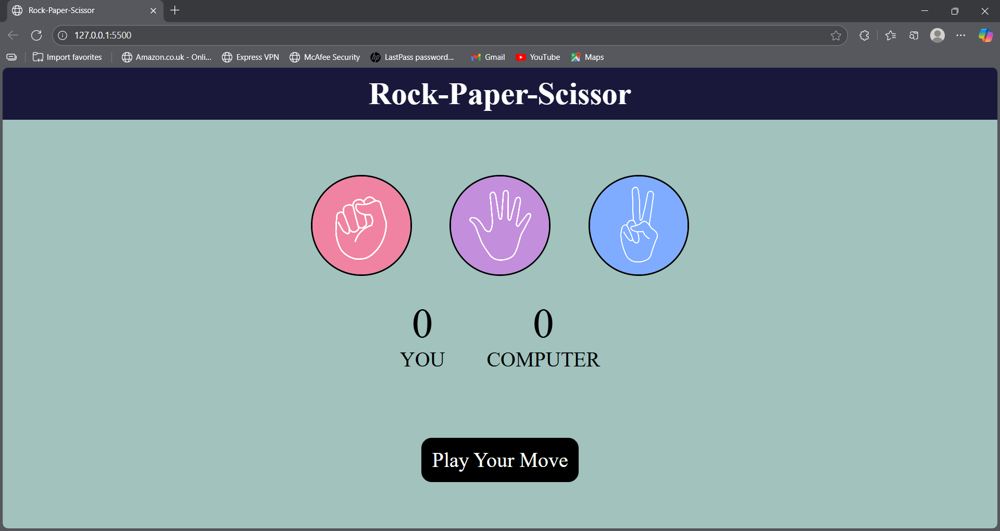
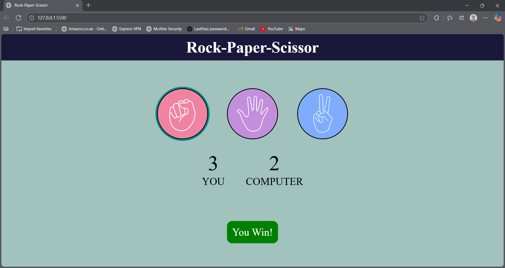

# 🎮 Rock-Paper-Scissors Game  

A simple and fun **Rock-Paper-Scissors** game built using **HTML, CSS, and JavaScript**.  
Play against the computer and see who wins!  

---

## 🎮 Play Now
[Click here to play Rock-Paper-Scissor]()
---

## 🖼️ Screenshot  
  
  

---

## 📌 Features  
- Classic Rock–Paper–Scissors gameplay.  
- Interactive UI with hover effects.  
- Keeps track of **Player Score** and **Computer Score**.  
- Responsive design that works on desktop & mobile.  

---

## 🛠️ Technologies Used  
- **HTML5** – for structure  
- **CSS3** – for styling and animations  
- **JavaScript (ES6)** – for game logic  

---

## 🎯 How to Play  
1. Click on **Rock**, **Paper**, or **Scissors**.  
2. The computer will randomly choose its move.  
3. The winner of the round will be displayed.  
4. Scores are updated after each round.  

---

## ⚡ Setup Instructions  
1. Clone this repository:  
   ```bash
   git clone https://github.com/<your-username>/<repository-name>.git
